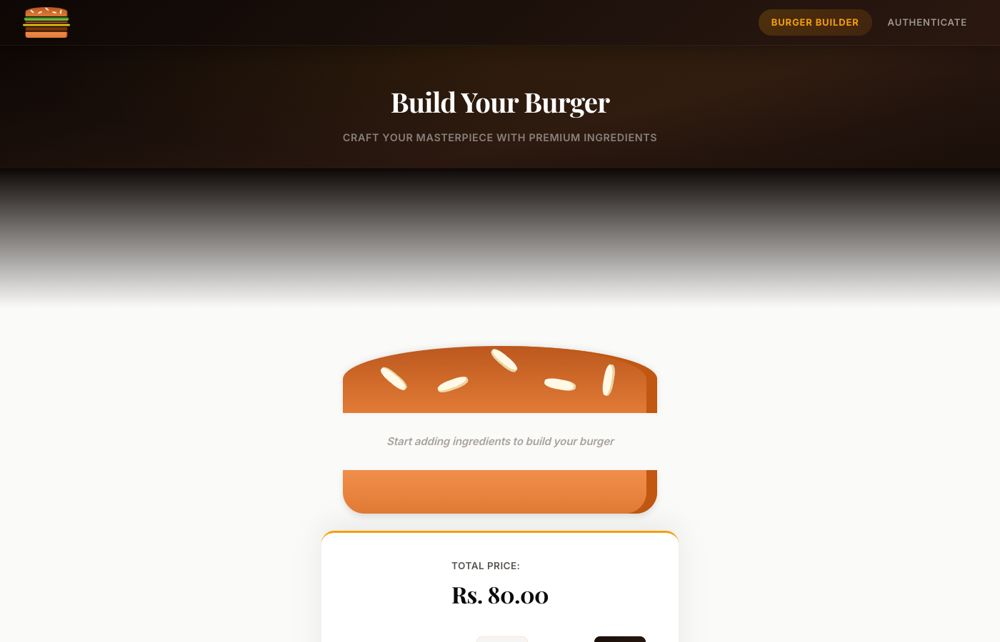
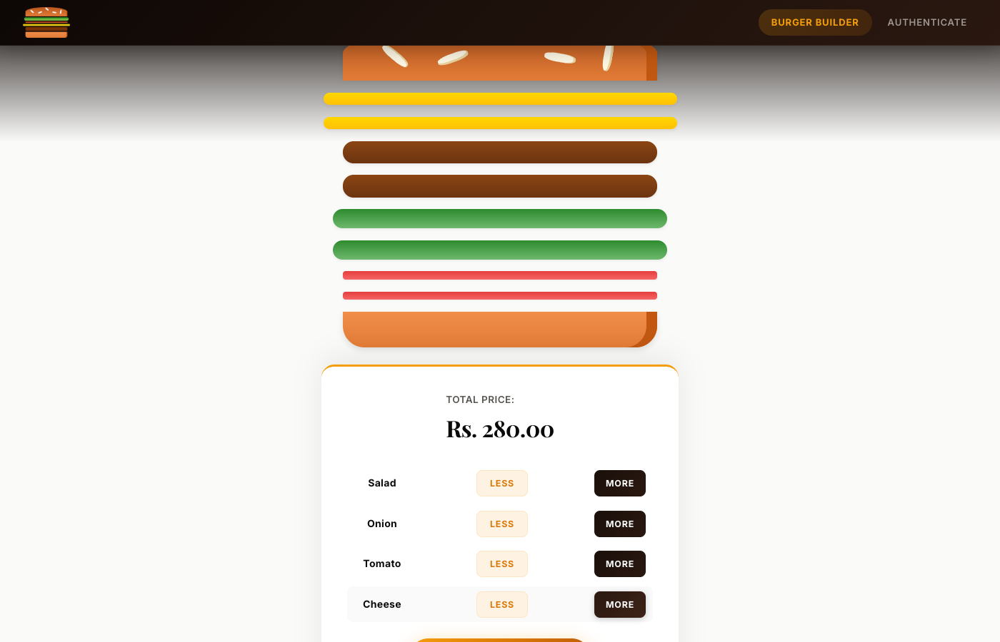
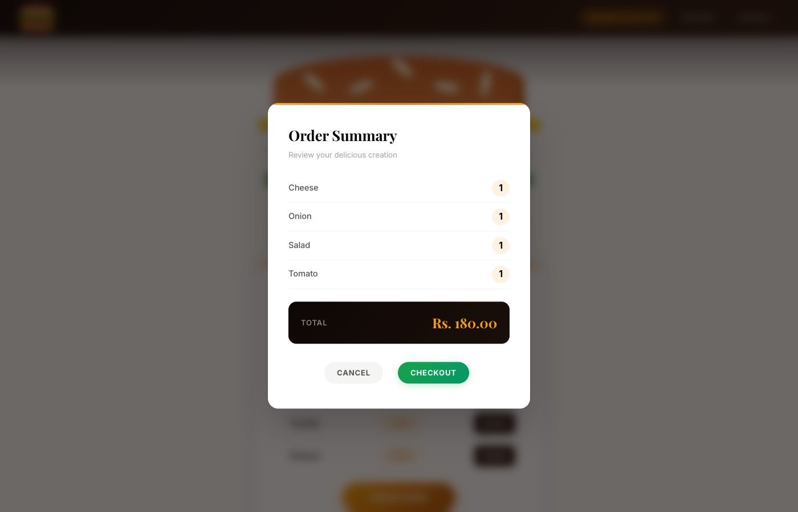
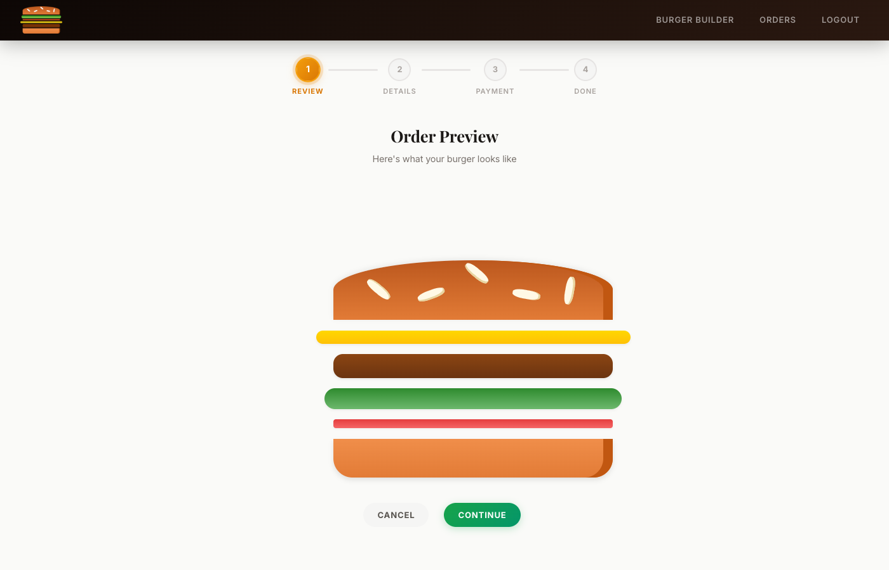
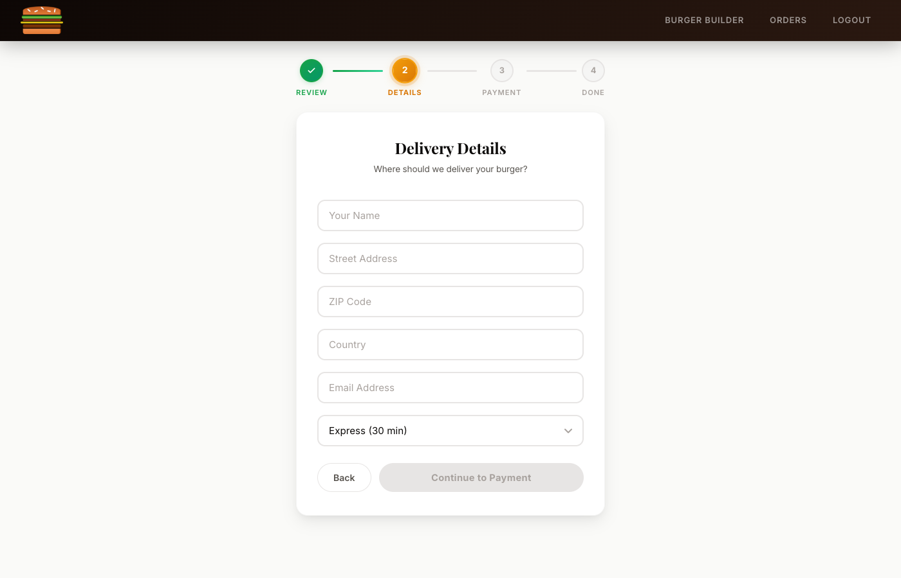
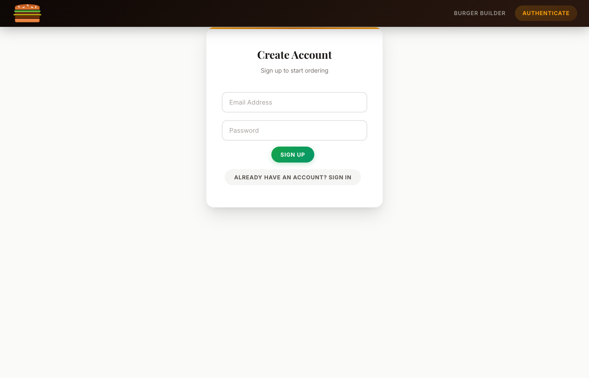

# Burger Builder

A full-featured burger customization and ordering app built with React, Redux, and Firebase.

**Live:** [https://burgerbuilder-priyanshsinghal.vercel.app](https://burgerbuilder-priyanshsinghal.vercel.app)

---

## Screenshots

### Build Your Burger


### Customize Ingredients


### Order Summary


### Multi-Step Checkout


### Delivery Details


### Authentication


---

## Features

- **Build Your Burger** — Add or remove ingredients (salad, cheese, onion, tomato) with real-time price updates
- **User Authentication** — Sign up and sign in with email/password via Firebase Auth
- **Multi-Step Checkout** — 4-step flow with progress indicator: Review, Details, Payment, Confirmation
- **Mock Payment Gateway** — Credit/Debit Card (with live card preview), UPI, and Cash on Delivery options
- **Order Success** — Animated confirmation page with order tracking timeline
- **Order History** — View all past orders with ingredient breakdown and pricing
- **Responsive Design** — Works on desktop and mobile with side drawer navigation

## Tech Stack

- **Frontend:** React 16, React Router 5, Redux + Redux Thunk
- **Backend:** Firebase Realtime Database, Firebase Authentication
- **Styling:** CSS Modules with custom design system (Inter + Playfair Display fonts)
- **Deployment:** Vercel (auto-deploy from GitHub)

## Getting Started

```bash
# Clone the repository
git clone https://github.com/priyansh18/burger_builder.git
cd burger_builder

# Install dependencies
npm install

# Create a .env file with your Firebase config
echo "REACT_APP_FIREBASE_API_KEY=your_api_key" > .env
echo "REACT_APP_FIREBASE_DB_URL=https://your-project.firebaseio.com" >> .env

# Start development server
npm start
```

Open [http://localhost:3000](http://localhost:3000) to view it in the browser.

## Scripts

| Command | Description |
|---------|-------------|
| `npm start` | Run development server |
| `npm run build` | Create production build |
| `npm test` | Run tests |

## Project Structure

```
src/
  components/       # Reusable UI components
    Burger/          # Burger display and controls
    Navigation/      # Toolbar, side drawer, nav items
    Order/           # Order cards and checkout summary
    OrderSuccess/    # Animated success page
    Payment/         # Mock payment gateway
    UI/              # Modal, buttons, inputs, spinner, step indicator
  containers/        # Page-level components with Redux
    Auth/            # Sign in / Sign up
    BurgerBuilder/   # Main burger building page
    Checkout/        # Multi-step checkout flow
    Orders/          # Order history
  hoc/               # Higher-order components (Layout, ErrorHandler)
  store/             # Redux actions and reducers
```
